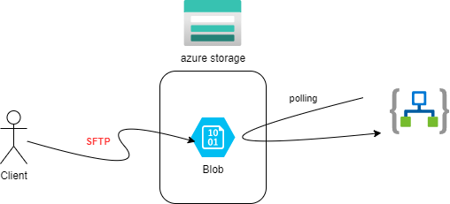

# logic apps と blob storage

 

## storage作成

SFTPを利用するための前提条件
```
標準の汎用 v2 または Premium ブロック BLOB ストレージ アカウント。
Azure Data Lake Storage Gen2 機能を使用して Azure Blob Storage をアップグレードする
```

ストレージの作成
```
# storage
az storage account create -n mystorage0001 -g az-logic-apps-example-rg -l japaneast --sku Standard_LRS --kind StorageV2
az storage account show-connection-string -g az-logic-apps-example-rg -n mystorage0001
```

Azure Data Lake Storage Gen2 機能　を有効にする
```
az storage account hns-migration start --type validation -n mystorage0001 -g az-logic-apps-example-rg
az storage account hns-migration start --type upgrade -n mystorage0001 -g az-logic-apps-example-rg
```

```
az storage account update -g az-logic-apps-example-rg --name mystorage0001 --enable-sftp=true
```

az storage account local-user regenerate-password --account-name contosoaccount -g contoso-resource-group -n contosouser


```
sftp mystorage0001.testcontainer01.testuser01@mystorage0001.blob.core.windows.net
```