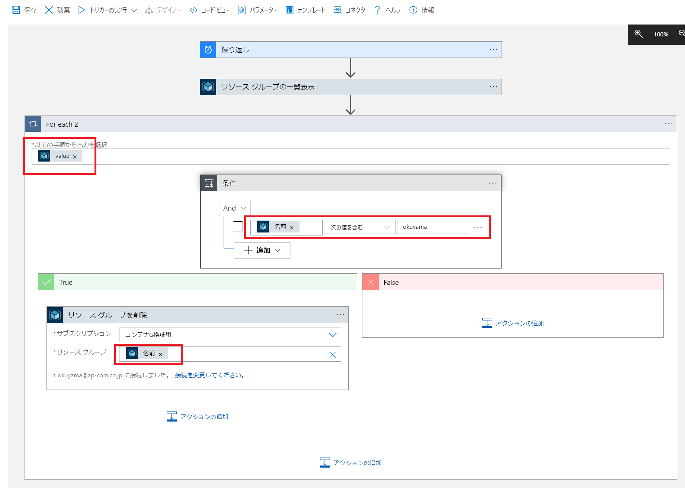

# リソースグループを削除する定期処理

Logic Apps を使って、簡単なワークフローを作成してみる。

## 開発環境について (portal or vscode)

https://docs.microsoft.com/ja-jp/azure/logic-apps/quickstart-create-logic-apps-visual-studio-code

vs codeの拡張機能を利用して開発を行うことが可能ではあるが、編集はJSON定義を直接編集することになる。

vs codeの拡張機能はビューとして利用可能。ロジック アプリのワークフローを視覚的に確認できる。ただし編集はできない。

(注意) MSのサンプルのJSONは時々間違っていることがあります。(jsonのタグが足りないとか。)
https://docs.microsoft.com/ja-jp/azure/logic-apps/logic-apps-data-operations-code-samples#parse-json-action-example


## 背景・ワークフローの内容

開発や検証でAzureのリソースを作成・削除を毎日のように行いますが、Azureの料金を節約するために利用していない時間帯はリソースを削除しておきたいです。

Logic Apps に就業時間後に毎日自動でリソースを削除させます。


## 構成
Portal画面から以下のように作成することが可能。



JSON形式の定義は以下のようになる。
```
{
    "definition": {
        "$schema": "https://schema.management.azure.com/providers/Microsoft.Logic/schemas/2016-06-01/workflowdefinition.json#",
        "actions": {
            "For_each_2": {
                "actions": {
                    "条件": {
                        "actions": {
                            "リソース_グループを削除": {
                                "inputs": {
                                    "host": {
                                        "connection": {
                                            "name": "@parameters('$connections')['arm']['connectionId']"
                                        }
                                    },
                                    "method": "delete",
                                    "path": "/subscriptions/@{encodeURIComponent('d79e0410-8e3c-4207-8d0a-1f7885d35859')}/resourcegroups/@{encodeURIComponent(items('For_each_2')?['name'])}",
                                    "queries": {
                                        "x-ms-api-version": "2016-06-01"
                                    }
                                },
                                "runAfter": {},
                                "type": "ApiConnection"
                            }
                        },
                        "expression": {
                            "and": [
                                {
                                    "contains": [
                                        "@items('For_each_2')?['name']",
                                        "okuyama"
                                    ]
                                }
                            ]
                        },
                        "runAfter": {},
                        "type": "If"
                    }
                },
                "foreach": "@body('リソース_グループの一覧表示')?['value']",
                "runAfter": {
                    "リソース_グループの一覧表示": [
                        "Succeeded"
                    ]
                },
                "type": "Foreach"
            },
            "リソース_グループの一覧表示": {
                "inputs": {
                    "host": {
                        "connection": {
                            "name": "@parameters('$connections')['arm']['connectionId']"
                        }
                    },
                    "method": "get",
                    "path": "/subscriptions/@{encodeURIComponent('d79e0410-8e3c-4207-8d0a-1f7885d35859')}/resourcegroups",
                    "queries": {
                        "x-ms-api-version": "2016-06-01"
                    }
                },
                "runAfter": {},
                "type": "ApiConnection"
            }
        },
        "contentVersion": "1.0.0.0",
        "outputs": {},
        "parameters": {
            "$connections": {
                "defaultValue": {},
                "type": "Object"
            }
        },
        "triggers": {
            "繰り返し": {
                "evaluatedRecurrence": {
                    "frequency": "Day",
                    "interval": 1,
                    "schedule": {
                        "hours": [
                            "20"
                        ]
                    },
                    "timeZone": "Tokyo Standard Time"
                },
                "recurrence": {
                    "frequency": "Day",
                    "interval": 1,
                    "schedule": {
                        "hours": [
                            "20"
                        ]
                    },
                    "timeZone": "Tokyo Standard Time"
                },
                "type": "Recurrence"
            }
        }
    },
    "parameters": {
        "$connections": {
            "value": {
                "arm": {
                    "connectionId": "/subscriptions/d79e0410-8e3c-4207-8d0a-1f7885d35859/resourceGroups/az-logic-apps-example-rg/providers/Microsoft.Web/connections/arm",
                    "connectionName": "arm",
                    "id": "/subscriptions/d79e0410-8e3c-4207-8d0a-1f7885d35859/providers/Microsoft.Web/locations/japaneast/managedApis/arm"
                }
            }
        }
    }
}
```
処理の内容
```
1. 繰り返し(決まった時間に実行するスケジュール)
2. リソースグループの一覧を取得
3. For each (取得したリソースグループ毎に繰り返す)
 3.1 条件の判定 
 3.2 条件に一致した場合は、リソースグループを削除する
```
フローが資格的に確認できるのは非常に分かりやすくて良いが、JSON形式の定義を直接編集してフローを開発するのは定義の理解などに手間がかかりすぎると感じる。

# まとめ1
(良い点)
様々なコネクターが準備されているので、プログラミング開発のコストがおさえられる。品質も安定する。

(悪い点)
JSON形式の定義を直接編集してフローを開発するには学習コストが高い。
VS Codeの拡張機能を使ってローカルでワークフローを編集することができる(シングルテナントのApp Service(Standard)の場合のみ。
バージョン管理はフローの定義ファイル(JSON)を管理することになる。

十分利用できそうではあるが、フローはあまり複雑にならないようにした方が良い。複雑なフローの場合は単純なフローの組み合わせで実現するなど工夫するのが良いと思う。


