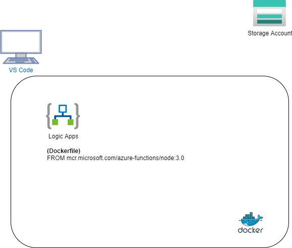

# logic Apps in Docker

DockerコンテナとしてLogic Appsを利用する。
最終的にはAKS上で動かす

## 作業環境
wsl(ubuntu) dotnetが必要
VS Code
VS Code extension Azure Logic Apps (Standard)
 ※ ConsumptionとStandardの２つがあります。Standardを利用します。

