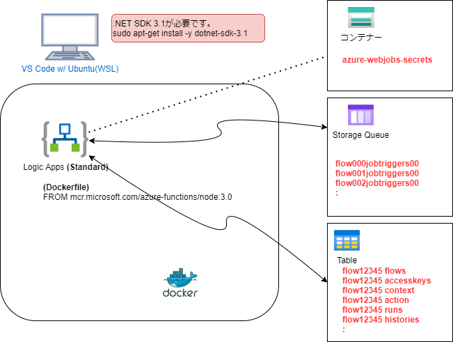
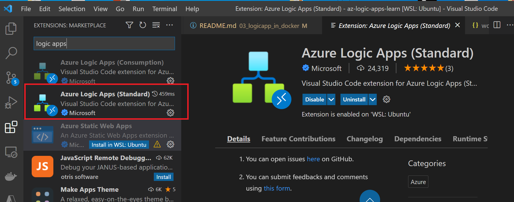
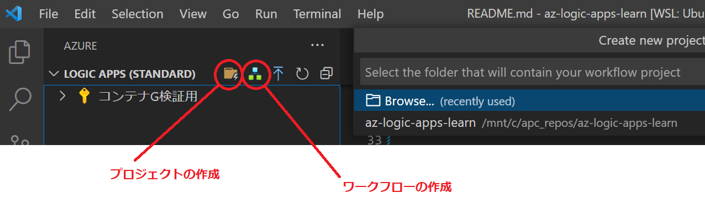
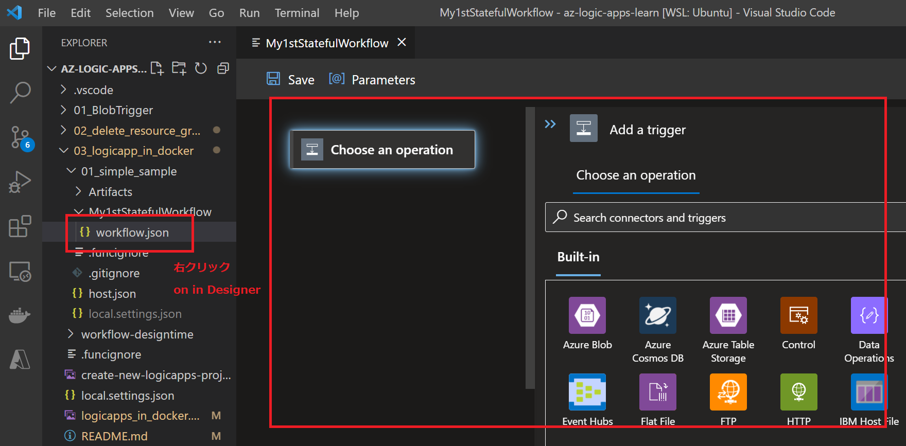

# logic Apps in Docker (Azure Kubernates Service)

Dockerイメージ (mcr.microsoft.com/azure-functions/node:3.0) を利用して Logic Apps (workflow) をローカル環境や、AKS(Kubernates)環境で実行できることが確認できたのでブログにしておきます。

## Logic App とは

iPaaS(Integration Platform as a Service)と呼ばれるサービスの一種です。
簡単に言うと、システム間の連携を行うサービスになります。世の中にはいろいろな製品がありますが、MuluSoftなどが代表的な例になります。logic appsはAzureのiPaaSという位置づけになります。


( Microsoftの説明によると )  
Logic Apps とはアプリ、データ、サービス、およびシステムを統合する自動化された "ワークフロー" を最小限のコーディングまたはノーコードで作成および実行するためのクラウドベースのプラットフォームです。


* 最小限のコーディング または ノーコード で作成とういうのが魅力的です。

## Logic App の仕組み
下記の図のようにStorage QueueやTableを利用してworkflowを実現しています。




## Logic Appの開発環境について

VS Code extension Azure Logic Apps (Standard)  を利用してローカル環境で workflowを定義し動作確認を行うことが可能です。
※ VS Code extension は ConsumptionとStandardの２つがあるので注意



私は今回、wsl(ubuntu)環境にdocker, dotnet sdkをインストールして検証を行いました。  


### Logic Appsを動かす為にはAzure Storageが必要(storage queueを利用しています)  
```
az storage account create -n myexamplestorage01 -g $RG_NAME -l $LOCATION --sku Standard_LRS --kind StorageV2
az storage account show-connection-string -g $RG_NAME -n myexamplestorage01
```

## .NET Core SDKのインストール　(ubuntu wsl)

https://docs.microsoft.com/ja-jp/dotnet/core/install/linux-ubuntu#2004

SDK のインストール、ランタイムをインストールする必要があります。

.NET Core 3.1 SDK (dotnet-sdk-3.1) をインストールする
```
sudo apt-get update; \
  sudo apt-get install -y apt-transport-https && \
  sudo apt-get update && \
  sudo apt-get install -y dotnet-sdk-3.1
```

.NET Core 3.1 SDKがインストールされていることを確認する
```
dotnet --list-sdks
3.1.420 [/usr/share/dotnet/sdk]
6.0.301 [/usr/share/dotnet/sdk]

dotnet --list-runtimes
Microsoft.AspNetCore.App 3.1.26 [/usr/share/dotnet/shared/Microsoft.AspNetCore.App]
Microsoft.AspNetCore.App 6.0.6 [/usr/share/dotnet/shared/Microsoft.AspNetCore.App]
Microsoft.NETCore.App 3.1.26 [/usr/share/dotnet/shared/Microsoft.NETCore.App]
Microsoft.NETCore.App 6.0.6 [/usr/share/dotnet/shared/Microsoft.NETCore.App]
```

# 簡単なlogic appsをコンテナとしてローカル環境(wsl)で動かす

vs codeの拡張機能(Azure Logic Apps (Standard)) を利用して、Logic Appのプロジェクトを新規に作成し、作成したプロジェクトをコンテナ化します。


## 1. プロジェクトの作成
新規で空のフォルダ(01_simple_sample)を作成して、vscodeの拡張機能で新規プロジェクトを作成する。


## 2. 簡単なワークフローの作成 


```
tree 
.
├── Artifacts
│   ├── Maps
│   └── Schemas
├── MyStatufulWorkflow
│   └── workflow.json
├── host.json
└── local.settings.json
```


## 3. vscode(ローカル)実行での確認

F5 or "Run and Debug" で ローカル実行が可能

※ Linuxではブレークポイントを有効にできない？　要確認
```
-------------------------------------------------------------------
You may only use the Microsoft .NET Core Debugger (vsdbg) with
Visual Studio Code, Visual Studio or Visual Studio for Mac software
to help you develop and test your applications.
-------------------------------------------------------------------
```

APIをcallして確認する。codeはAzure Storageのコンテナー(azure-webjobs-secretsのhost.json)に格納されている。

```
curl -X POST -d "" -H "Content-Type: application/json" "http://localhost:7071/runtime/webhooks/workflow/api/management/workflows/MyStatufulWorkflow/triggers/manual/listCallbackUrl?api-version=2020-05-01-preview&code=AowtL60lxc05tbRWvCA9bhWajXn5WO3hfC-pD5P6GIu-AzFuc2y-2A=="
```

```
curl -X POST -d @sample.json -H "Content-Type: application/json" \
"http://localhost:7071/api/MyStatufulWorkflow/triggers/manual/invoke?api-version=2020-05-01-preview&sp=%2Ftriggers%2Fmanual%2Frun&sv=1.0&sig=ZtJOVD8TwORnV0oiMgqfAFO3RB2lQZecMatXFKXmQTA"
im working fine
```

logic apps(workflow)からの出力が確認できる

## 4. ローカル実行（コンテナとして実行）

イメージ作成と確認 (sizeが1.59GBもあります。)
```
docker build --tag my-logicapps:v1 .
docker images | grep my-logicapps
my-logicapps                     v1                     61326060ea61   11 minutes ago   1.59GB
```

実行
```
docker run --rm -p 8080:80 my-logicapps
```

APIをcallして確認する。codeはAzure Storageのコンテナー(azure-webjobs-secretsのhost.json)に格納されている。
```
curl -X POST -d "" -H "Content-Type: application/json" \
"http://localhost:8080/runtime/webhooks/workflow/api/management/workflows/MyStatufulWorkflow/triggers/manual/listCallbackUrl?api-version=2020-05-01-preview&code=PzhD2_UdggcGXctmR8r0GB6clZtEnPcAuRnEBU8Am8kaAzFuVrBjTw=="
```

プロトコルをhttpsからhttpにして、ポートを合わせて実行
```
curl -X POST -d @sample.json -H "Content-Type: application/json" \
"http://localhost:8080/api/MyStatufulWorkflow/triggers/manual/invoke?api-version=2020-05-01-preview&sp=%2Ftriggers%2Fmanual%2Frun&sv=1.0&sig=W0Ue4MjE9HjizyPFQZueIwWC2IF6pNLa9UowbPFYlng"
im working fine
```
logic apps(workflow)からの出力が確認できる

## ACR へ Push して動作確認
```
az acr login -n acr001example
az acr build -t my-logicapps:v1 -r acr001example .
```

pull
```
docker pull acr001example.azurecr.io/my-logicapps:v1
```

# Azure Kubernates Service で実行
AKSリソースの準備
```
az aks create --resource-group $RG_NAME --name myAKSCluster --node-count 1 --enable-addons monitoring --generate-ssh-keys
```

認証情報
```
az aks get-credentials --resource-group $RG_NAME --name myAKSCluster
kubectl get nodes
```

deploymentとしてデプロイ
```
az aks update -n myAKSCluster -g $RG_NAME --attach-acr acr001example
kubectl apply -f manifest_k8s/my-logicapps-dep.yml
```
※内容は Load Balancer と deployment の２つ

確認 ※ローカル環境と同様にCURLで確認する
```
curl -X POST -d "" -H "Content-Type: application/json" \
"http://20.210.43.210/runtime/webhooks/workflow/api/management/workflows/MyStatufulWorkflow/triggers/manual/listCallbackUrl?api-version=2020-05-01-preview&code=PzhD2_UdggcGXctmR8r0GB6clZtEnPcAuRnEBU8Am8kaAzFuVrBjTw=="
```

※プロトコルはhttpにして、ipaddreとport番号はLocad Balancerのモノを指定
```
curl -X POST -d @sample.json -H "Content-Type: application/json" \
"http://20.210.43.210/api/MyStatufulWorkflow/triggers/manual/invoke?api-version=2020-05-01-preview&sp=%2Ftriggers%2Fmanual%2Frun&sv=1.0&sig=nAVxG2J6V3_CVqPsW1t1FyYgGO_zMB_ivbdyvf62BbI"
im working fine
```
logic apps(workflow)からの出力が確認できる

# まとめ
