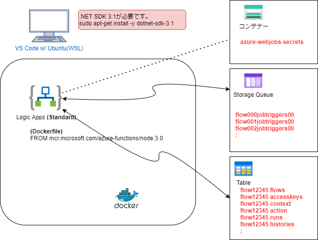
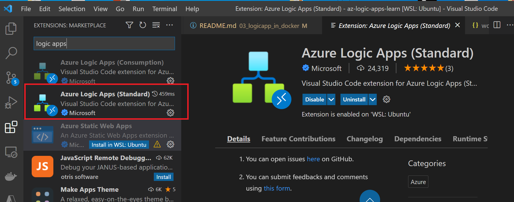
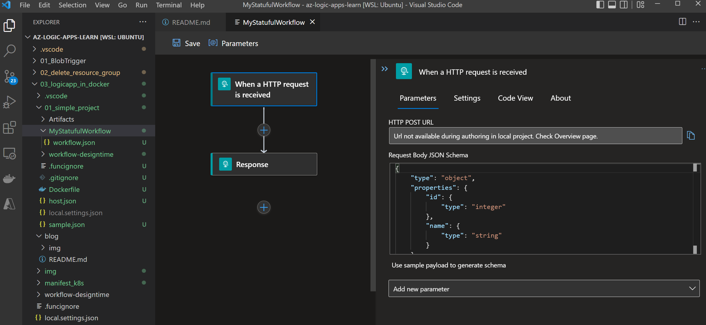

# logic Apps in Docker (Azure Kubernates Service)

Dockerイメージ (mcr.microsoft.com/azure-functions/node:3.0) を利用して Logic Apps (workflow) をローカル環境や、AKS(Kubernates)環境で実行できることが確認できたのでブログにしておきます。

## Logic App とは

iPaaS(Integration Platform as a Service)と呼ばれるサービスの一種です。
簡単に言うと、システム間の連携を行うサービスになります。世の中にはいろいろな製品がありますが、MuluSoftなどが代表的な例になります。logic appsはAzureのiPaaSという位置づけになります。


( Microsoftの説明によると )  
Logic Apps とはアプリ、データ、サービス、およびシステムを統合する自動化された "ワークフロー" を最小限のコーディングまたはノーコードで作成および実行するためのクラウドベースのプラットフォームです。


* 最小限のコーディング または ノーコード で作成とういうのが魅力的です。

## Logic App の仕組み

下記の図のようにStorage QueueやTableを利用してworkflowを実現しています。




## Logic Appの開発環境について

VS Code extension Azure Logic Apps (Standard)  を利用してローカル環境で workflowを定義し動作確認を行うことが可能です。
※ VS Code extension は ConsumptionとStandardの２つがあるので注意。今回はシングルテナントなのでStandardを選択です。



私は今回、wsl(ubuntu)環境にdocker, dotnet sdk(.NET Core 3.1 SDK)をインストールして検証を行いました。  


今回は以下のような簡単なワークフローを vs code で作成しました。

内容としては下記の２つ
1. Http Requestを受信するトリガー
2. ClientにResponseを返すアクション



※ ローカル環境でのデバッグなどもある程度できるようになっています。

## コンテナ化

ベースイメージに mcr.microsoft.com/azure-functions/node:3.0 を指定してイメージを作成します。

```
cat Dockerfile
FROM mcr.microsoft.com/azure-functions/node:3.0
ENV AzureWebJobsStorage <BlobStorageConnectionString>
ENV AzureWebJobsScriptRoot=/home/site/wwwroot AzureFunctionsJobHost__Logging__Console__IsEnabled=true FUNCTIONS_V2_COMPATIBILITY_MODE=true
ENV WEBSITE_HOSTNAME localhost
ENV WEBSITE_SITE_NAME myexamplelogicapp
ENV AZURE_FUNCTIONS_ENVIRONMENT Development
COPY . /home/site/wwwroot
```
"BlobStorageConnectionString" の部分を自分のStorageアカウントの接続文字列に変更して build します。
```
docker build --tag my-logicapps:v1 .
docker images | grep my-logicapps
my-logicapps                     v1                     61326060ea61   11 minutes ago   1.59GB
```
※サイズが1.59GBもあります。。。

## コンテナをロカールＰＣで実行して確認

```
docker run --rm -p 8080:80 my-logicapps
```

APIをcallして確認する。codeはAzure Storageのコンテナー(azure-webjobs-secretsのhost.json)に格納されている。
```
curl -X POST -d "" -H "Content-Type: application/json" \
"http://localhost:8080/runtime/webhooks/workflow/api/management/workflows/MyStatufulWorkflow/triggers/manual/listCallbackUrl?api-version=2020-05-01-preview&code=PzhD2_UdggcGXctmR8r0GB6clZtEnPcAuRnEBU8Am8kaAzFuVrBjTw=="
```

プロトコルをhttpsからhttpにして、ポートを合わせて実行
```
curl -X POST -d @sample.json -H "Content-Type: application/json" \
"http://localhost:8080/api/MyStatufulWorkflow/triggers/manual/invoke?api-version=2020-05-01-preview&sp=%2Ftriggers%2Fmanual%2Frun&sv=1.0&sig=W0Ue4MjE9HjizyPFQZueIwWC2IF6pNLa9UowbPFYlng"
im working fine
```
logic apps(workflow)からの出力が確認できる

## レジストリー(ACR) へ Push して Azure Kubernates Service で動作確認
通常のコンテナイメージと同様にレジストリー(ACR) へ Push します。
```
az acr login -n acr001example
az acr build -t my-logicapps:v1 -r acr001example .
```

### Azure Kubernates Service で実行
AKSリソースの準備
```
az aks create --resource-group $RG_NAME --name myAKSCluster --node-count 1 --enable-addons monitoring --generate-ssh-keys

# acrをアタッチしておく
az aks update -n myAKSCluster -g $RG_NAME --attach-acr acr001example
```

認証情報
```
az aks get-credentials --resource-group $RG_NAME --name myAKSCluster
kubectl get nodes
```

deployment と Load Balancerをデプロイ
```
kubectl apply -f manifest_k8s/my-logicapps-dep.yml
```
※ my-logicapps-dep.yml の内容は Load Balancer と deployment

動作確認 ※ロードバランサーのIPアドレスに向けてAPIを発行する
```
curl -X POST -d "" -H "Content-Type: application/json" \
"http://20.210.43.210/runtime/webhooks/workflow/api/management/workflows/MyStatufulWorkflow/triggers/manual/listCallbackUrl?api-version=2020-05-01-preview&code=PzhD2_UdggcGXctmR8r0GB6clZtEnPcAuRnEBU8Am8kaAzFuVrBjTw=="
```

※プロトコルはhttpにして、ipaddreとport番号はLocad Balancerのモノを指定
```
curl -X POST -d @sample.json -H "Content-Type: application/json" \
"http://20.210.43.210/api/MyStatufulWorkflow/triggers/manual/invoke?api-version=2020-05-01-preview&sp=%2Ftriggers%2Fmanual%2Frun&sv=1.0&sig=nAVxG2J6V3_CVqPsW1t1FyYgGO_zMB_ivbdyvf62BbI"
im working fine
```
logic apps(workflow)からの出力が確認できる

# まとめ
いろいろと不明の点はありますが、Kubernatesで Azure Logic Apps を動作させることができました。

(参考にしたサイト)
https://www.c-sharpcorner.com/article/create-docker-image-of-azure-logic-app-standard-and-deploy-in-azure-kubernetes-s/